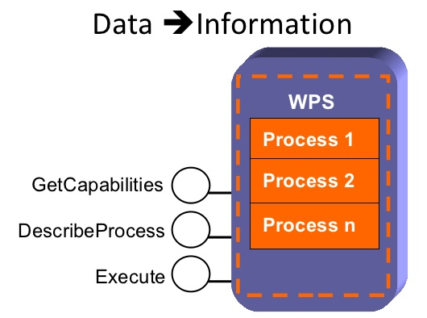

************
Introduction
************

What is PyWPS
-------------

    * PyWPS is an implementation of the `Web Processing Service standard`_
      from the `Open Geospatial Consortium`_. PyWPS is written in `Python`_
    * Started in spring 2006
    * Supports all tools available in Python for geospatial operations
    * http://pywps.org

What PyWPS is *NOT*
-------------------

    * complicated
    * a client
    * a GUI
    * a server with pre-installed processes
    
    
The OGC Web Processing Service
------------------------------

   * OGC open web standard for remote geo-spatial processing.
   * Integrated with web data services: **WFS**, **WCS**.
   * Three basic requests:
   
      * *GetCapabilities*
      * *DescribeProcess*
      * *Execute*
      
   * Two basic input/output classes:
   
      * *Literal*
      * *Complex* - for geo-spatial data and services
      
      
The OGC Web Processing Service
------------------------------

      
http://www.slideshare.net/TheodorFoerster/restful-web-processing-service
      
      
Essential PyWPS Functionality
-----------------------------

   * Communication bridge with WPS.
   * Fetch input data referenced in *Execute* request.
   * Create a container for the process instance.
   * Manage process: communication, reporting, logging.
   * Output data storage.
   * Client notification.
   

.. _`Web Processing Service standard`: http://opengeospatial.org/standards/wps
.. _`Open Geospatial Consortium`:  http://opengeospatial.org
.. _`Python`: https://python.org

