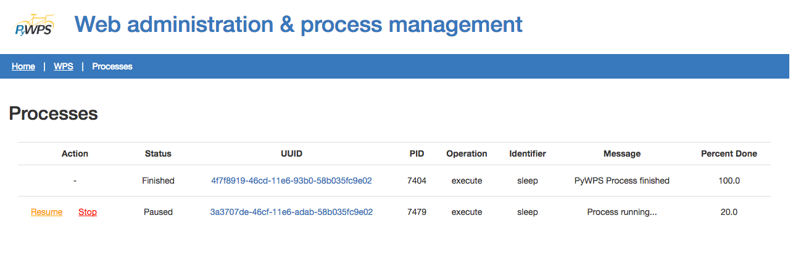

*******
PyWPS-4
*******
   
Motivation for PyWPS-4
----------------------

   * PyWPS is now a decade old.
   * Python version 3 taking over.
   * New bindings for other libraries (e.g PyGRASS).
   * New data formats (e.g. GeoJSON, KML, TopoJSON).
   * Version 2.0 of the WPS standard.
   * Less restrictive licence (MIT).
   
   
New Technologies
----------------

   * lxml
   * Flask / Werkzeug
   * WSGI
   * Multiprocessing
   * PyPy
   * Jython
   * OWSLib
   
   
Data Validation
---------------

   * A four level approach:
   
      -  **No validation** - always considered valid.
      -  **Simple validation** - uses just the *mimeType*.
      -  **Strict validation** - attempts to open *Complex* inputs with GDAL, comparing with *mimeType*.
      -  **Very strict validation** - uses an XML schema.

   * Plus custom validation, already including: ESRI Shapefile, GeoJSON, GML, GeoTIFF.
      
      
Process Containerising
----------------------

   * WPS server should run *Execute* requests concurrently.
   
      - but in totally insulated fashion;
      - no shared resources or data.
      
   * PyWPS-3:
   
      - a temporary folder is created for each *Execute*;
      - resulting data is moved to publishing folder;
      - temporary folder is deleted at execution end.
      
   * PyWPS-4 aims at a safer approach (e.g Docker, vagrant)

      
Asynchronous Execution
----------------------

   * PyWPS can process various *Execute* requests in parallel:
   
      - configurable number;
      - plus a queue of waiting requests.
      
   * PyWPS-4 now uses the *Multiprocessing* module:
   
      - *os.fork()* abandoned;
      - PyWPS *should* now run on Windows too.
      
   * Process metadata now stored in a database (SQLite, PostgreSQL - logging, request queueing, etc). - GSoC project
   * Local database to support WPS 2.0.
      
      
Future Work
-----------

   * New requests in WPS 2.0: *Pause*, *Release*, *Delete*.
   * Improved security with process containerising.
   * Administrative web interface.
   * External services to publish outputs.
   * REST API
   * Support for other languages beyond English.

Administration interface and REST API
-------------------------------------

